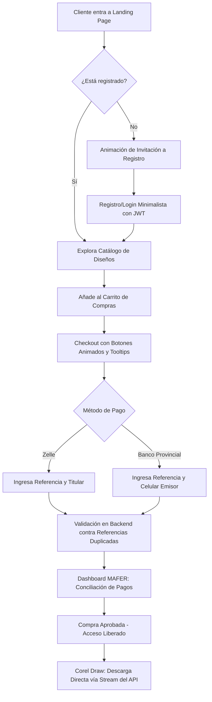

# Plan de Implementación y Desarrollo - SubliAcrilico SaaS

Este documento detalla el plan estratégico, la arquitectura técnica, la división de hitos (milestones) y los prompts de IA correspondientes para el desarrollo del SaaS **SubliAcrilico**.

---

## 1. Ficha Técnica y Configuración

### 1.1. Identidad Visual (Branding System)
*   **Colores Primarios & Acentos**:
    *   Fondo Oscuro/Base: `#0C100E` (Negro Oliva Profundo)
    *   Acento Interactivo/Llamados a la Acción: `#97754D` (Bronce Medio)
    *   Bordes/Fondos Secundarios: `#C2AD90` (Beige Claro / Arena)
    *   Tarjetas/Secciones de Contraste: `#364442` (Gris Azulado / Pizarra)
    *   Textos Destacados/Títulos Especiales: `#5D4429` (Marrón Oscuro / Bronce)
*   **Tipografía**:
    *   **Athena**: Títulos principales, logotipos y slogans (`h1`, `h2`, headers de marca).
    *   **Outfit / Inter**: Textos, inputs, tooltips, formularios y descripciones de productos.

### 1.2. Entorno y Credenciales
El backend lee la configuración desde `backend/.env`. Las credenciales ya configuradas son:
*   `PORT=5000`
*   `DATABASE_URL` / `DIRECT_DATABASE_URL` (Neon Postgres Connection Strings)
*   `JWT_SECRET` (Llave secreta para codificación JWT)
*   `CLOUDINARY_CLOUD_NAME`, `CLOUDINARY_API_KEY`, `CLOUDINARY_API_SECRET` (Credenciales para carga de imágenes y videos)

---

## 2. Definición de Usuarios y Roles

| Rol | Contraseña Inicial | Funcionalidad Principal |
| :--- | :--- | :--- |
| **DEV** | `Devsubliacrilico` | Dashboard TI: Métricas en línea, tiempo de permanencia, auditoría de logs, análisis financiero completo y gestión CRUD total de Clientes. |
| **MAFER** | `MaferAdmin` | Dashboard Administrativo: Gestión de catálogo de diseños (archivos Corel), control de inventario/ventas, conciliación de pagos (Zelle/Provincial) y creación de usuarios. |
| **CLIENTE** | Registro propio | Landing Page Animada -> Registro Interactivo -> Catálogo Premium -> Compra Fluida -> Descarga Directa (Corel). |

### 2.1. Estructura de Vistas y Pantallas (SaaS Minimalista de $10,000)
Para cumplir con la filosofía de interactividad extrema, evitar recargas molestas y maximizar la fluidez visual, la aplicación se estructurará en únicamente **4 Rutas Principales** con pestañas dinámicas (Tabs) y modales/drawers interactivos:

#### 1. Ruta `/` (Pública & Cliente Catálogo)
*   **Sección Landing Premium**: Presentación de la marca, lema en fuente `Athena`, y transiciones de entrada animadas.
*   **Catálogo de Muestras**: Tarjetas interactivas de diseños de Corel Draw con hover 3D.
*   **Modales y Drawers Flotantes (En la misma página para evitar redirecciones)**:
    *   *Modal Registro/Login*: Formulario animado que aparece con transiciones y muestra tooltips al hacer focus en cada input.
    *   *Drawer del Carrito de Compra*: Panel lateral deslizante que resume los diseños añadidos con botones de escala interactiva.
    *   *Modal de Checkout*: Módulo interactivo con interruptores gráficos de Zelle / Provincial para reportar el pago con pocos clicks y sin formularios infinitos.

#### 2. Ruta `/mis-compras` (Cliente Autenticado - Privada)
*   **Mi Biblioteca de Diseños**: Panel minimalista que lista los diseños comprados.
*   *Botón de Descarga*: Si el pago está aprobado, activa un botón brillante de **Descarga Directa (.cdr)**. Si está pendiente, muestra una barra de progreso o loader animado indicando verificación.

#### 3. Ruta `/admin` (Dashboard de MAFER - Privada)
*   **Consola Administrativa Modular (Pestañas Animadas)**:
    *   *Pestaña Catálogo*: Subida drag-and-drop de mockups (a Cloudinary) e ingreso de File ID de Google Drive.
    *   *Pestaña Ventas & Conciliación*: Lista visual de pagos reportados. Incluye botones de aprobación directa y el módulo drag-and-drop para subir archivos CSV de estados de cuenta que aprueban múltiples transacciones de golpe.
    *   *Pestaña Cuentas*: Lógica para gestionar administradores.

#### 4. Ruta `/dev` (Dashboard de DEV - Privada)
*   **Centro de Control TI (Pestañas Analíticas)**:
    *   *Pestaña Analíticas Avanzadas*: Tarjetas animadas y gráficos fluidos con: total de clientes, usuarios conectados en línea, tiempo de permanencia promedio de los usuarios en la web y facturación.
    *   *Pestaña Gestión Clientes (CRUD)*: Tabla interactiva para buscar, editar información de perfiles o eliminar clientes directamente.
    *   *Pestaña Logs de Sistema*: Visualización de errores, llamadas al API y estado de base de datos Neon.

---


## 3. Flujo de Negocio y Lógica de Compra



### 3.1. Descarga de Archivos de Corel Draw
1. El administrador (MAFER) sube el archivo `.cdr` a su Google Drive personal.
2. Configura los permisos del archivo como **"Cualquier persona con el enlace"** (lector) y copia el ID del archivo (o el enlace completo).
3. Registra este ID/enlace en el panel de catálogo de productos de la web.
4. Al completarse y aprobarse la compra, el cliente hace clic en "Descargar archivo Corel".
5. El frontend llama al endpoint `/api/downloads/:purchaseId`.
6. El backend verifica en Neon DB que la compra de ese cliente esté efectivamente aprobada.
7. Si el pago es válido, el backend descarga el archivo desde el enlace público directo de Google Drive (`https://drive.google.com/uc?export=download&id=DRIVE_FILE_ID`) y lo transmite como un stream binario directamente al navegador del cliente (`res.setHeader('Content-Disposition', 'attachment; filename="diseno.cdr"')`).
8. **Seguridad y Ventajas**: El cliente **nunca** ve el enlace de Google Drive, no necesita cuenta de Google ni iniciar sesión, no tiene acceso a otros archivos de la cuenta de Mafer, y la descarga se realiza de forma totalmente automática y directa desde nuestra página web. ¡Todo el proceso es 100% gratis y no requiere configurar ni pagar Google Cloud!


### 3.2. Automatización y Conciliación de Pagos (Zelle y Provincial)
Dado que las APIs directas de bancos personales en Zelle (Bancos de EE.UU.) y Banco Provincial (Venezuela) no son accesibles públicamente para cuentas individuales, implementaremos un **Sistema Híbrido de Conciliación Automatizada**:

1.  **Filtro Antifraude de Referencias (Instantáneo)**:
    *   Toda transacción registrada guarda la referencia bancaria única en la tabla `Purchase` de Neon Postgres.
    *   Si un cliente intenta registrar un pago usando una referencia que ya fue registrada previamente en el sistema, la validación de Zod y base de datos la rechaza instantáneamente. Esto previene el fraude común de compartir un mismo capture/comprobante.
2.  **Validación Automática para Banco Provincial (Pago Móvil / Transferencias)**:
    *   **Pasarela SMS Gateway**: Los pagos móviles envían una notificación SMS en tiempo real al teléfono del comercio ("Provincial: Recibio Pago Movil... Ref: 123456 por Bs 350").
    *   Utilizaremos una app de pasarela SMS (e.g. SMS Gateway for Android) instalada en el dispositivo del negocio que redirige estos SMS mediante un Webhook POST a `/api/payments/provincial-webhook`.
    *   El backend extrae automáticamente el número de referencia, el monto y el teléfono emisor. Si coincide con una compra pendiente de aprobación, **el sistema la aprueba y libera el diseño inmediatamente**.
3.  **Conciliación Inteligente para Zelle y Banco Provincial (Carga de Estados de Cuenta)**:
    *   En el panel de **MAFER**, se habilitará un cargador de archivos (`.csv` o `.xlsx`) de estados de cuenta.
    *   Mafer puede exportar sus movimientos diarios de Zelle (del correo o banco) o del Provincial, y subirlos a la web.
    *   El backend analiza las líneas en segundos, busca coincidencias de números de referencia y montos, aprueba los pagos válidos pendientes y notifica a los clientes para descargar.
4.  **Simulación de Aprobación en Desarrollo**:
    *   Durante las fases de prueba, el dashboard de MAFER incluirá un "Simulador de Conciliación" interactivo donde se puede pre-aprobar el pago con un clic para validar el flujo completo.


---

## 4. Hitos de Implementación (Milestones)

El proyecto se dividirá en **6 Hitos** independientes para mantener el desarrollo descentralizado y modular.

### Hito 1: Estructura del Backend, Base de Datos e Inicio Unificado (Neon + Prisma + Express + Root CLI)
*   **Objetivo**: Inicializar el backend en TypeScript, conectar con Neon Postgres usando Prisma, validar conectividad de base de datos y Cloudinary en el arranque del servidor, y configurar un script de inicio unificado en la raíz del proyecto para arrancar backend y frontend en paralelo con un único comando.
*   **Entregables**:
    *   `package.json` en el directorio raíz del proyecto con la librería `concurrently` para iniciar todo con `npm run dev`.
    *   Configuración de Express con TypeScript en `/backend`.
    *   Esquema `schema.prisma` con las tablas de base de datos migradas exitosamente a Neon Postgres.
    *   Scripts de arranque que realizan pruebas automáticas de conexión a la base de datos Neon y validan credenciales de Cloudinary.
    *   Estructura modular de carpetas en el backend.


### Hito 2: Sistema de Autenticación Segura y Validaciones (JWT + Zod)
*   **Objetivo**: Desarrollar la lógica de registro, login y control de sesiones mediante tokens JWT (cookies httpOnly). Validar todas las entradas de datos con esquemas de Zod.
*   **Entregables**:
    *   Endpoints de `/api/auth/register` y `/api/auth/login`.
    *   Middlewares de validación Zod y protección de rutas (`verifyToken`, `requireRole`).
    *   Lógica de tracking de inicio/cierre de sesión para métricas de tiempo en línea.

### Hito 3: Integraciones Clave (Google Drive API + Cloudinary)
*   **Objetivo**: Configurar las herramientas de almacenamiento. Subida de imágenes/videos a Cloudinary y lógica de descarga oculta y segura de archivos desde Google Drive.
*   **Entregables**:
    *   Servicio de subida a Cloudinary (`cloudinaryService.ts`).
    *   Servicio de streaming y descarga segura de Google Drive (`driveService.ts`).
    *   Endpoint `/api/downloads/:purchaseId` con verificación de pago.

### Hito 4: Lógica de Carrito de Compra y Validación de Pagos (Zelle + Provincial)
*   **Objetivo**: Implementar la lógica del carrito de compras y el procesamiento/validación de referencias de pago Zelle y Banco Provincial.
*   **Entregables**:
    *   Esquema de compras y detalle de compras en base de datos.
    *   Endpoints de `/api/purchases/checkout` y `/api/purchases/validate-payment`.
    *   Verificación contra fraudes de referencias duplicadas.

### Hito 5: Frontend Premium Animado (React + Framer Motion)
*   **Objetivo**: Construir la interfaz de usuario en el directorio `Frontend`. Desarrollar la Landing Page premium con la paleta de colores y la tipografía `Athena`, el catálogo interactivo y el sistema de tooltips animados.
*   **Entregables**:
    *   Estructura modular del Frontend en React.
    *   Configuración de estilos globales y carga de fuentes Athena/Outfit.
    *   Landing page interactiva sin login expuesto directamente (invitación animada al hacer click en comprar).
    *   Carrito de compras interactivo con animaciones fluidas y tooltips explicativos integrados.

### Hito 6: Dashboards de Control e Integración Real-Time (DEV & MAFER + WebSockets)
*   **Objetivo**: Desarrollar los dashboards especializados para los administradores y establecer una conexión WebSockets bidireccional permanente usando Socket.io para notificaciones y analíticas en tiempo real.
*   **Entregables**:
    *   **Integración de Socket.io**: Servidor socket configurado en el backend y cliente socket configurado en el frontend.
    *   **Dashboard DEV** (`Devsubliacrilico`): Gráficos y tarjetas animadas alimentados en tiempo real por sockets con usuarios activos, registros, tiempo promedio de permanencia y CRUD de clientes.
    *   **Dashboard MAFER** (`MaferAdmin`): Gestión de productos y alertas en tiempo real al recibir pagos pendientes; cargador de CSV para conciliación masiva.
    *   **Lógica de Notificación al Cliente**: Actualización instantánea en la pantalla del cliente cuando su pago es aprobado por Mafer o conciliado por CSV, habilitando el botón de descarga del editable sin recargar.


### Hito 7: Despliegue Final (Backend en Render + Frontend en Netlify)
*   **Objetivo**: Preparar y desplegar los ambientes de producción para el backend y frontend de bajo consumo de forma 100% gratuita.
*   **Entregables**:
    *   Configuración de compilación de producción del Backend (`npm run build` con `tsc`) y optimización del script de ejecución (`node dist/server.js`).
    *   Despliegue del Backend en Render (configuración de variables de entorno, CORS dinámico y redirecciones).
    *   Despliegue del Frontend en Netlify (configuración de build `npm run build` de Vite, redirección de SPA con `_redirects` para React Router y variables de entorno del API).

---

## 5. Prompts de IA para Ejecución Descentralizada

A continuación, se presentan los prompts exactos listos para copiar e inicializar cada hito con un agente de IA:

### Prompt Hito 1 (Backend, DB Setup & Root CLI)
```text
Por favor, actúa como un desarrollador full-stack y de bases de datos relacionales experto en Node.js, TypeScript y Prisma.
Necesitamos inicializar la estructura base, la base de datos relacional y el comando único de arranque para el proyecto SubliAcrilico.
Requisitos:
1. **Configuración del Inicio Unificado en el Directorio Raíz**:
   - Inicializa un 'package.json' en la carpeta raíz del proyecto.
   - Instala 'concurrently' en las dependencias de desarrollo de la raíz.
   - Configura el script '"dev": "concurrently \"npm run dev --prefix backend\" \"npm run dev --prefix Frontend\""' y '"install-all": "npm install --prefix backend && npm install --prefix Frontend"' para poder iniciar y configurar todo con un solo comando.
2. **Inicialización del Backend**:
   - Configura un 'package.json' en '/backend' optimizado con express, typescript, prisma, @prisma/client, ts-node-dev, cors, dotenv, cloudinary, y types de desarrollo.
   - Crea y configura 'tsconfig.json'.
3. **Esquema de Base de Datos (Prisma & Neon)**:
   - Revisa el archivo 'backend/.env' para obtener las credenciales de base de datos Neon (DATABASE_URL y DIRECT_DATABASE_URL).
   - Diseña el esquema de Prisma ('backend/prisma/schema.prisma') que contenga las siguientes entidades con relaciones:
     * User (id, email, password, name, role [DEV, MAFER, CLIENTE], createdAt, updatedAt)
     * Product (id, title, description, price, imagePublicId, imageUrl, videoUrl, googleDriveFileId, createdAt, updatedAt)
     * Purchase (id, userId, total, status [PENDIENTE, APROBADO, RECHAZADO], paymentMethod [ZELLE, PROVINCIAL], paymentReference, paymentHolder, paymentPhone, createdAt, updatedAt)
     * PurchaseItem (id, purchaseId, productId, priceAtPurchase)
     * SessionLog (id, userId, loginTime, logoutTime, ipAddress, deviceType)
   - Ejecuta la primera migración de Prisma ('prisma migrate dev --name init') para configurar las tablas en Neon Postgres.
   - Crea un script de siembra (seed) en prisma para crear los usuarios por defecto:
     * DEV (email: dev@subliacrilico.com, password encriptado de 'Devsubliacrilico', role: DEV)
     * MAFER (email: mafer@subliacrilico.com, password encriptado de 'MaferAdmin', role: MAFER)
4. **Verificación de Conectividad en el Servidor Backend**:
   - Crea la estructura de carpetas: config, controllers, middlewares, routes, services, utils, y app.ts / server.ts en 'backend/src'.
   - Al iniciar el servidor, implementa un chequeo automático:
     * Neon Test: Realiza una consulta rápida con Prisma (ej. contar usuarios) para imprimir "Neon Postgres: Conexión exitosa" en consola.
     * Cloudinary Test: Instancia la conexión de Cloudinary utilizando las variables de entorno de '.env' y comprueba que las credenciales no sean nulas, imprimiendo "Cloudinary: Configuración validada" en consola.
5. **Esqueleto del Frontend**:
   - Inicializa el directorio '/Frontend' con un proyecto base de Vite + React + TypeScript e instala 'react-icons' y 'framer-motion' para que compile correctamente al ejecutar 'npm run dev' desde la raíz.
No avances en la lógica de endpoints complejos de venta ni pasarelas, solo enfócate en la base de datos, la estructura y la inicialización correcta y unificada del servidor.
```


### Prompt Hito 2 (Autenticación JWT + Zod)
```text
Actúa como un desarrollador de backend experto en ciberseguridad y TypeScript.
Necesitamos implementar el flujo completo de autenticación y validación de datos en el backend de SubliAcrilico.
Requisitos:
1. Instala jsonwebtoken, bcryptjs, cookie-parser y zod, junto con sus respectivos tipos de desarrollo (@types/jsonwebtoken, @types/bcryptjs, @types/cookie-parser).
2. Crea los esquemas de validación con Zod para el Registro de Clientes y Login (email y contraseña válidos, formatos estrictos).
3. Implementa el controlador y las rutas de autenticación en '/api/auth/register' y '/api/auth/login'.
4. La sesión debe manejarse guardando el JWT en una cookie httpOnly, Secure y SameSite=Strict para mayor seguridad.
5. Desarrolla un middleware 'verifyToken' y otro 'requireRole(roles: string[])' para asegurar las rutas de la API en base a los roles DEV, MAFER y CLIENTE.
6. Agrega un middleware global de captura de errores para responder siempre con JSON estructurado en caso de fallos de validación Zod o errores de sistema.
7. Implementa la lógica de tracking en 'SessionLog' para registrar cuándo inicia sesión un usuario, cuándo cierra sesión (en '/api/auth/logout') y actualizar periódicamente su actividad para calcular el tiempo promedio en el sitio.
Asegúrate de escribir código limpio, modular y completamente tipado en TypeScript.
```

### Prompt Hito 3 (Cloudinary + Google Drive Integration)
```text
Actúa como un desarrollador experto en integraciones de servicios y APIs en Node.js/TypeScript.
Necesitamos implementar el servicio de carga multimedia con Cloudinary y el proxy seguro para descargas desde Google Drive.
Requisitos:
1. Revisa en 'backend/.env' las credenciales de Cloudinary ya configuradas.
2. Crea 'backend/src/services/cloudinaryService.ts' para manejar la subida y eliminación de imágenes/videos de productos usando el SDK de Cloudinary.
3. Para la descarga segura de archivos de Google Drive sin usar APIs de pago ni Service Accounts complejas, crearemos 'backend/src/services/googleDriveService.ts'. El servicio debe tomar el 'googleDriveFileId' de la base de datos (que corresponde a un archivo compartido como público/lector) y realizar una petición HTTP utilizando un cliente como axios o node-fetch hacia la URL: `https://drive.google.com/uc?export=download&id=${fileId}`.
4. El backend debe descargar el archivo en segundo plano como un stream de datos.
5. Implementa el endpoint '/api/downloads/:purchaseId'. Este endpoint debe:
   - Verificar con Prisma que el cliente haya comprado el diseño y que el estado de la compra sea 'APROBADO'.
   - Si es válido, usar 'googleDriveService' para obtener el stream de datos del archivo .cdr y reenviarlo al frontend agregando los headers correspondientes ('Content-Disposition', 'attachment; filename="diseno.cdr"') para forzar la descarga directa en el navegador.
¡El enlace original de Google Drive y el ID del archivo jamás deben quedar expuestos al usuario final!
```

### Prompt Hito 4 (Carrito de Compras & Pagos Zelle/Provincial)
```text
Actúa como un desarrollador backend experto en lógica de e-commerce y transacciones financieras.
Necesitamos implementar el carrito de compras y la validación de pagos en SubliAcrilico.
Requisitos:
1. Diseña la lógica del Checkout en '/api/purchases/checkout' que reciba una lista de IDs de productos en el cuerpo de la petición.
2. Valida la existencia y precio actual de los productos usando Prisma, y crea un registro de 'Purchase' con estatus PENDIENTE y sus respectivos 'PurchaseItem'.
3. Implementa el endpoint '/api/purchases/submit-payment' para registrar el pago de una compra:
   - El cliente debe enviar el ID de compra, el método de pago (ZELLE o PROVINCIAL), la referencia del pago, el correo/nombre del titular (si es Zelle) y el celular emisor (si es Banco Provincial).
   - Valida con Zod los campos.
   - Consulta en la base de datos si el número de referencia ya fue utilizado por cualquier usuario en transacciones anteriores. Si ya existe, rechaza la operación inmediatamente para evitar fraude.
   - Si no existe, actualiza el estado de la compra a PENDIENTE_APROBACION y guarda los datos de la referencia.
Escribe tests de validación o scripts sencillos para probar que las referencias duplicadas se rechacen eficazmente.
```

### Prompt Hito 5 (Frontend Premium & Framer Motion)
```text
Actúa como un desarrollador frontend experto en React, Tailwind y animaciones con Framer Motion, con un gusto exquisito por el diseño premium (SaaS de $10,000 USD).
Necesitamos desarrollar el sitio web público y la lógica del cliente para SubliAcrilico.
Requisitos:
1. Configura el proyecto en 'Frontend/' usando Vite, React, React Router y Framer Motion.
2. Configura los estilos globales para aplicar la paleta de colores del proyecto:
   - Fondos oscuros premium: #0C100E
   - Acentos de bronce/oro: #97754D
   - Bordes y textos claros: #C2AD90 y #364442
   - Tipografía principal: Integra la fuente elegante 'Athena' para títulos (puedes usar fuentes similares premium cargadas localmente o Google Fonts equivalentes de lujo como Cormorant Garamond / Playfair Display como fallback si no está el archivo físico).
3. Landing Page de Ensueño: Debe contener secciones fluidas (Hero con animación de entrada, Quiénes somos de alto impacto visual, Catálogo interactivo de diseños con vista previa de imágenes y videos cortos).
4. Animación de Login/Registro: La página no debe mostrar un formulario de entrada directamente. Al hacer click en "Registrarse para comprar" en un producto, debe desplegarse un modal con una transición fluida en Framer Motion que guíe al usuario a crear su cuenta con inputs interactivos.
5. Componente Tooltip Animado: Desarrolla un componente reutilizable de Tooltip interactivo. Al hacer hover o focus en cualquier input o botón crítico del carrito y checkout, debe desplegarse una pequeña animación explicativa de lo que se requiere en ese campo.
6. Lógica de Carrito de Compras: Permite añadir diseños al carrito, seleccionar el método de pago (Zelle / Provincial) mediante interruptores animados muy visuales, y completar la compra con alertas dinámicas.
```

### Prompt Hito 6 (Dashboards e Integración Real-Time con WebSockets)
```text
Actúa como un desarrollador frontend y backend full-stack experto en dashboards corporativos, paneles analíticos e integración en tiempo real con WebSockets.
Necesitamos implementar los dashboards para DEV y MAFER en SubliAcrilico agregando una capa interactiva y reactiva 100% en tiempo real usando Socket.io.

Requisitos:
1. **Configuración de Socket.io (Backend)**:
   - Instala 'socket.io' y '@types/socket.io' (devDependency) en '/backend'.
   - Integra Socket.io en 'backend/src/server.ts' enlazándolo con el servidor Express.
   - Crea eventos de WebSocket:
     * 'connection': Registra cuando un usuario entra a la web, incrementa el contador de usuarios en línea y emite a la sala DEV el número de usuarios activos actualizado en tiempo real.
     * 'disconnect': Decrementa el contador de usuarios en línea y emite la actualización a la sala DEV.
     * 'new-payment': Emitido por el backend cuando un cliente completa el checkout de pago. Pushes en tiempo real al panel de MAFER mostrando un toast animado e insertando la nueva transacción en la tabla sin recargar.
     * 'payment-approved': Emitido por el backend cuando MAFER (o el cargador CSV) aprueba un pago. Pushes en tiempo real al socket del cliente específico para cambiar la vista de su diseño a "Descargar" instantáneamente y con una animación de éxito, sin recargar la página.
2. **Configuración de Socket.io (Frontend)**:
   - Instala 'socket.io-client' en '/Frontend'.
   - Crea un contexto de React ('Frontend/src/context/SocketContext.tsx') para gestionar la conexión del socket cliente, haciendo que se conecte dinámicamente a la IP LAN o local (`http://${window.location.hostname}:5000`) utilizando credentials correspondientes.
3. **Dashboard MAFER (Administradora) - Ruta '/admin'**:
   - Pestaña Catálogo: Formulario minimalista con drag-and-drop para mockups de Corel (a Cloudinary) e ingreso de File ID de Google Drive.
   - Pestaña Ventas: Tabla premium animada que muestra transacciones reportadas. Escucha el evento socket 'new-payment' para insertar filas de inmediato con alertas. Botones para Aprobar/Rechazar con un clic.
   - Pestaña Conciliador CSV: Cargador drag-and-drop de archivos CSV bancarios. Al procesar el CSV en el backend, emite el evento 'payment-approved' por sockets a todos los clientes correspondientes que hayan sido conciliados.
4. **Dashboard DEV (Desarrollo y TI) - Ruta '/dev'**:
   - Tarjetas de Métricas Real-Time: Muestra usuarios registrados, usuarios activos en línea (actualizado en vivo por el socket), tiempo promedio en la web y facturación.
   - Panel CRUD Clientes: Tabla para buscar, ver compras, editar perfiles o eliminar clientes directamente.
   - Panel Logs: Auditoría de eventos de socket y peticiones a la API.
5. **Route Guards**:
   - Protege en React Router las rutas '/admin' y '/dev'. Redirige a '/' con animaciones y mensajes de advertencia si el rol del usuario no es MAFER o DEV respectivamente.
6. **Compilación y Arranque**:
   - Asegúrate de que compile limpiamente en ambos lados ('npm run build') y arranque en paralelo.
```


### Prompt Hito 7 (Despliegue Final - Backend en Render & Frontend en Netlify)
```text
Actúa como un DevOps y desarrollador Full-Stack experto.
Necesitamos realizar el despliegue final en producción del SaaS SubliAcrilico utilizando Render (para el Backend) y Netlify (para el Frontend).
Requisitos:
1. **Configuración de Producción del Backend**:
   - Asegura que en 'backend/package.json' existan los scripts 'build' ("tsc") y 'start' ("node dist/server.js" o el archivo de inicio compilado).
   - El archivo 'tsconfig.json' debe compilar el código de TypeScript hacia una carpeta 'dist'.
   - Agrega un middleware en Express para forzar redirección HTTPS en producción.
   - Configura las reglas de CORS en 'app.ts' para leer la URL permitida desde una variable de entorno `FRONTEND_URL` (que será la URL provista por Netlify).
2. **Configuración del Despliegue en Render (Backend)**:
   - Indica al usuario los pasos para enlazar el repositorio GitHub, seleccionar "Web Service", establecer el Environment en "Node" y configurar los comandos:
     * Build Command: "npm install && npm run build" (y opcionalmente ejecutar migraciones de Prisma "npx prisma migrate deploy").
     * Start Command: "npm start".
   - Detalla las variables de entorno que deben cargarse en el panel de Render copiadas desde 'backend/.env' (DATABASE_URL, DIRECT_DATABASE_URL, JWT_SECRET, CLOUDINARY_*, NODE_ENV="production").
3. **Configuración del Despliegue en Netlify (Frontend)**:
   - Configura un archivo 'Frontend/public/_redirects' con el contenido `/* /index.html 200` para asegurar que las rutas internas de React Router funcionen correctamente al recargar páginas en Netlify.
   - Indica los pasos para conectar GitHub en Netlify, seleccionar la carpeta base 'Frontend', y configurar:
     * Build Command: "npm run build".
     * Publish Directory: "dist" (o "build" según la configuración de Vite).
   - Detalla que debe cargarse la variable de entorno `VITE_API_URL` con la URL HTTPS proporcionada por Render.
4. **Verificación de Seguridad**:
   - Implementa un endpoint de Health Check `/api/health` para validar que el servidor Render esté en línea.
   - Verifica que las cookies del JWT viajen de forma segura a través del dominio cruzado en producción ajustando 'sameSite: "none"' y 'secure: true' si es necesario.
```

---

## 6. Checklist de Recursos y Requerimientos de Configuración (Para el Usuario)

Antes de iniciar la ejecución de los hitos, el usuario debe proveer o configurar los siguientes elementos:

- [ ] **Configuración de Google Drive**:
  - Subir los archivos editables `.cdr` de Corel Draw a una carpeta en tu Google Drive personal.
  - Asegúrate de cambiar el permiso de cada archivo (o de la carpeta entera) a **"Cualquier persona con el enlace"** en calidad de **Lector**. Esto permitirá al servidor backend acceder y descargar el archivo de forma automatizada cuando un pago sea válido.
  - No es necesario registrarse en Google Cloud Console ni configurar cuentas de servicio, eliminando costos y configuraciones complejas.
- [ ] **Fuentes Tipográficas**:
  - Asegurar la disponibilidad de la fuente `Athena` en formato `.woff2` o `.ttf` en el directorio `Frontend/src/assets/fonts/` o definir la fuente alternativa de reemplazo (como una tipografía serif premium de Google Fonts en fallback).
- [ ] **Simulador de Pagos**:
  - Para pruebas iniciales, el backend contará con un validador simulado para Zelle y Provincial en el panel de MAFER. Para entornos reales de producción futura, se requerirá el uso de APIs bancarias o webhooks especializados.
- [ ] **Cuentas en Plataformas de Despliegue**:
  - Crear una cuenta gratuita en [Render.com](https://render.com/) para alojar el Backend.
  - Crear una cuenta gratuita en [Netlify.com](https://netlify.com/) para alojar el Frontend.
  - Subir el repositorio de código del proyecto a una cuenta personal de GitHub para poder vincularlo a ambas plataformas.

